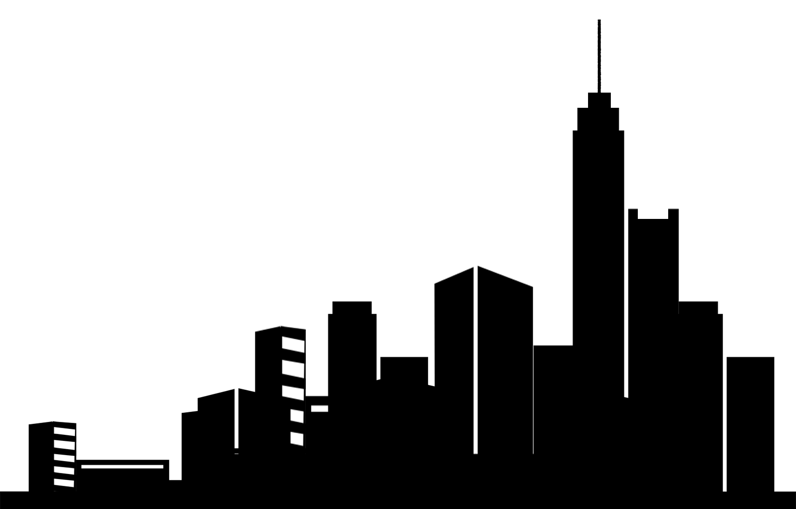

# 小册学习  demo
掘金小册的学习demo： [如何使用 Canvas 制作出炫酷的网页背景特效](https://juejin.im/book/5a0ab8e2f265da43111fbab2)

#### 小册介绍
这本小册比较简单，对canvas的一些应用场景介绍，api的介绍，然后通过一个例子进行实战；

#### 看完小册之后便动起手来
背景颜色模拟昼夜交替的做法让我有点意外，这小脑袋也太机智了
笔者利用了一个蓝黑的渐变作为最底层的背景颜色，然后通过一个有透明度动画效果的遮罩层实现昼夜交替的效果；

```javascript
<div class="wrapper">
    <div class="wrapper_mark"></div>
    
    <canvas id="canvas"></canvas>
</div>
```

```css
<style type="text/css">
    body, html{
         padding: 0;
         margin: 0;
    }
    .wrapper {
        font-size: 0;
        background: linear-gradient(to bottom, #000000 0%, #5788fe 100%);
        position: relative;
    }
    .wrapper_mark {
        width: 100%;
        height: 100%;
        position: absolute;
        top: 0;
        left: 0;
        background: #fe5757;
        animation: colorChange 30s ease-in-out infinite;
        animation-fill-mode: both;
        mix-blend-mode: overlay;
    }
    .img {
        position: absolute;
        width: 100%;
        z-index: 20;
        left: 0;
        right: 0;
        bottom: 0;
    }
    #canvas {
        position: relative;
        z-index: 10;
    }

    @keyframes colorChange {
        0%, 100% {
            opacity: 0;
        }
        50% {
            opacity: .9;
        }
    }
</style>
```
canvas的逻辑部分全部在CanvasRond.js中，在使用时先引入，


```javascript
window.onload = () => {
    let canvas = document.getElementById('canvas');
    this.canvasRond = new CanvasRond({
        el: canvas,
        width: window.innerWidth,
        height: window.innerHeight,
        initRoundPopulation: 40 // 粒子的个数
    })
}
```

用面向对象的方式，会使整个逻辑更加的清晰；
*CanvasRond是整个舞台对象
*RounItem是粒子对象
*MouseRound是触摸移动生成的圆的对象

```javascript
class CanvasRond {
  constructor({el, width, height, initRoundPopulation}) {
    this.el = el;
    this.width = width;
    this.height = height;
    this.el.width = this.width;
    this.el.height = this.height;
    this.initRoundPopulation = initRoundPopulation;
    this.content = this.el.getContext('2d');
    this.init();
  }
  // 初始化
  init() {
    this.rounds = [];
    let {content, initRoundPopulation, width, height} = this;
    for (let i = 0; i < initRoundPopulation; i++) {
      this.rounds[i] = new RounItem({
        index: i,
        x: Math.random() * width,
        y: Math.random() * height,
        content
      });
      this.rounds[i].draw();
    }
    this.addEventListener();
    this.render();
  }
  // 渲染
  render() {
    let {width, height, content} = this;
    content.clearRect(0, 0, width, height);
    this.rounds.forEach(item => {
      item.y < 0 ? (item.y = height) : item.move();
    })
    this.mouseRounds.forEach((item, index) => {
      item.r < 0 ? this.mouseRounds.splice(index, 1) : item.move();
    })
    requestAnimationFrame(this.render.bind(this));
  }
  // 添加事件
  addEventListener() {
    this.mouseRounds = [];
    let lock = false;
    window.addEventListener('touchmove', e => {
      if (!lock) {  //节流
        lock = true;
        this.mouseRounds.push(new MouseRound({
          x: e.touches[0].clientX,
          y: e.touches[0].clientY,
          r: 6,
          content: this.content
        }));
        setTimeout(() => {
          lock = false
        }, 30);
      }
    })
  }
}

class RounItem {
  constructor({index, x, y, content}) {
    this.content = content;
    this.index = index;
    this.x = x;
    this.y = y;
    this.r = Math.random() * 2 + 1;
    let alpha = (Math.floor(Math.random() * 10) + 1) / 10 / 2;
    this.color = "rgba(255, 255, 255, " + alpha + ")";
  }

  draw() {
    let {content, color, r, x, y} = this;
    content.fillStyle = color;
    content.shadowBlur = r * 2;
    content.beginPath();
    content.arc(x, y, r, 0, 2 * Math.PI, false);
    content.closePath();
    content.fill();
  }

  move() {
    this.y -= 0.15;
    this.draw();
  }
}

class MouseRound {
  constructor({x, y, r, content}) {
    this.content = content;
    this.x = x;
    this.y = y;
    this.r = r;
    this.color = '#fff';
  }

  draw() {
    let {content, color, r, x, y} = this;
    content.fillStyle = color;
    content.shadowBlur = r * 5;
    content.shadowColor = '#fff';
    content.beginPath();
    content.arc(x, y, r, 0, 2 * Math.PI, false);
    content.closePath();
    content.fill();
  }

  move() {
    this.r -= 0.2;
    if (this.r < 0) return;
    this.draw();
  }
}
```

#### 小结
以上逻辑也比较的简单，利用对于画布的清除和再次重绘，实现动画；
利用requestAnimationFrame，我们可以实现60/s的刷新频率，对于画布上所要出现的东西，我们都用对象的方式，去存储在list中，每次刷新的时候我们都可以去改变对象的属性，并在requestAnimationFrame的回调函数中，我们清空画布并且把最新的list中的对象渲染到画布中；

dranein@163.com

地址：https://github.com/Dranein/activities-/tree/master/canvas/city